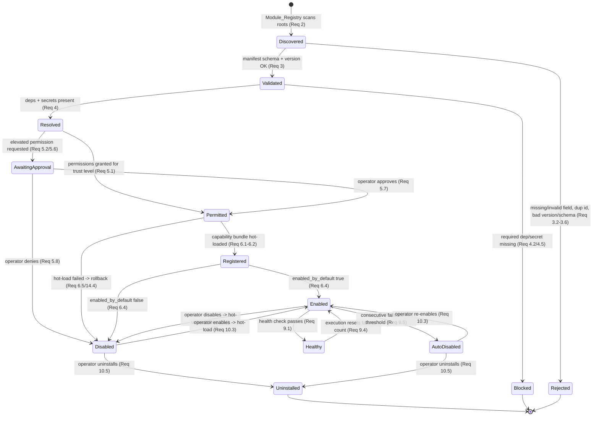
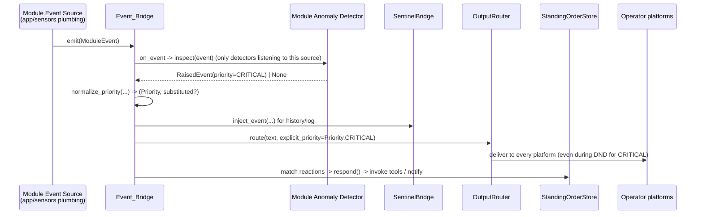

# Design Document — Modular Extension Platform

## Overview

The Modular Extension Platform (the **Module_Platform**) turns AetherRavyn from a fixed-capability
agent into an extensible platform. Today every extension point is wired separately:

- Skills are discovered by `SkillRegistry` (`app/core/skill_registry.py`) from `module.yaml` /
  `SKILL.md` manifests and returned as plain `dict` records.
- Tools and agents are registered imperatively against `SystemKernel`
  (`app/core/kernel.py`) and `SwarmManager` (`app/core/agency.py`).
- Sensors live under `app/sensors/` and push events through `SentinelBridge`
  (`app/core/sentinel_bridge.py`) into the ambient loop (`app/core/ambient_loop.py`).
- Delivery priority is decided by `OutputRouter` (`app/core/output_router.py`).
- Permissions are evaluated by `PolicyEngine` (`app/core/policy.py`), isolation by
  `SandboxManager` (`app/core/sandbox_manager.py`), secrets by `SecretVault`
  (`app/core/secret_vault.py`), and audit by `ActionLogger` (`app/core/audit.py`).

Adding a new behavior generally means editing core code. This feature defines **one unified module
contract** — a generalization of the existing `module.yaml` — so a user can package a **Capability
Bundle** (any combination of tools, agents, skills, event sources, anomaly detectors, proactive
reactions, and an optional UI surface) into a single installable **Module**. The platform
auto-discovers, validates, resolves dependencies and secrets, assigns least-privilege permissions
and sandboxing by trust level, hot-loads the bundle into the running process, health-checks it, and
supports enable/disable, hot-unload, and uninstall — without editing core code and, where feasible,
without a restart.

The platform **wraps and reuses** the existing components rather than replacing them. The new code
lives under a new domain package, `app/modules/`, per AGENTS.md ("New features go in
`app/<domain>/`"). Six new components compose the platform:

| New component | Wraps / drives | Responsibility |
|---------------|----------------|----------------|
| `Module_Registry` | `SkillRegistry`, `SystemKernel` | Discover, validate, track Modules; record state in the capability graph |
| `Module_Loader` | all subsystems | Orchestrate the lifecycle: validate → resolve → permit → register/hot-load → enable/disable → hot-unload → uninstall, atomically |
| `Permission_Broker` | `PolicyEngine`, `Operator` | Evaluate `required_permissions` against trust level; gate elevated grants |
| `Health_Monitor` | `SkillRegistry` health report, ambient loop | Run health checks, count consecutive failures, auto-disable |
| `Event_Bridge` | `app/sensors/`, `SentinelBridge`, `OutputRouter`, `StandingOrderStore` | Route module event sources → detectors → priority delivery → reactions |
| `Module_CLI` | `app/cli`, `app/api`/dashboard | List, inspect, scaffold, install, enable, disable, uninstall |

The driving worked example is a user-built **home-protection module**: it registers a camera event
source, runs an anomaly detector that raises a prioritized event into the ambient pipeline, grants
Ravyn a surveillance tool, and triggers a proactive reaction (alert the operator + snapshot the
camera). The module is **bidirectional**: it feeds events in and exposes tools the orchestrator can
invoke to act back through it.

### Grounding notes and explicit assumptions

The design is faithful to the current interfaces. Where the current code lacks a capability the
platform needs, the gap is called out as an **assumption** the implementation must close:

- **A1 — `SkillRegistry.discover()` returns `list[dict]`, not dataclasses.** The `Module_Registry`
  adapts those dicts into typed `ModuleRecord` objects; it does not change `SkillRegistry`'s return
  type (Req 14.1).
- **A2 — No deregistration APIs exist.** `SystemKernel`, `SwarmManager`, and `StandingOrderStore`
  expose only register/parse methods. The platform therefore maintains its own authoritative
  **registration ledger** per module and adds thin `deregister_*` helpers to those subsystems so
  hot-unload can fully reverse a hot-load (Req 10.7). The ledger, not subsystem introspection, is
  the source of truth for rollback.
- **A3 — `PolicyEngine` has no per-trust-level grant table.** It evaluates a single merged
  `user_permissions | agent_permissions` set. The `Permission_Broker` adds a trust-level default
  grant table layered on top of `PolicyEngine.evaluate(...)`, reusing `PolicyDecision`.
- **A4 — The dependency `check` command is declared but not executed.** `SkillRegistry`
  normalizes dependencies (`_normalize_dependencies`) into `{name,status,required,message}` but never
  runs the `check` shell command. The platform adds a `DependencyResolver` that executes each
  `check` through `SandboxManager` and maps the result to `satisfied | unsatisfied | unknown`
  (Req 4.1). This is the "existing dependency-check mechanism" extended to actually run.
- **A5 — `SentinelBridge` uses a `LOW/MEDIUM/HIGH/CRITICAL` severity scale**, while `OutputRouter`
  uses the `Priority` IntEnum. The `Event_Bridge` owns the mapping between detector-declared
  `Priority` and the delivery path.

---

## Architecture

### Component diagram

```mermaid
graph TB
    subgraph authoring["Authoring & Management"]
        CLI["Module_CLI<br/>(app/cli + ravyn modules ...)"]
        DASH["Dashboard panels<br/>(app/api/ui.py, app/web)"]
    end

    subgraph platform["app/modules/ — Module_Platform"]
        REG["Module_Registry<br/>discover / validate / track"]
        LOADER["Module_Loader<br/>lifecycle orchestration<br/>atomic register + rollback"]
        BROKER["Permission_Broker<br/>trust-level grants + approvals"]
        HEALTH["Health_Monitor<br/>checks + failure counting + auto-disable"]
        EBRIDGE["Event_Bridge<br/>source -> detector -> priority -> reaction"]
        LEDGER["RegistrationLedger<br/>per-module undo log (A2)"]
        DEPRES["DependencyResolver (A4)"]
    end

    subgraph existing["Existing core (wrapped, not replaced)"]
        SKILLS["SkillRegistry"]
        KERNEL["SystemKernel<br/>capability graph"]
        POLICY["PolicyEngine / PolicyDecision"]
        SANDBOX["SandboxManager<br/>docker/subprocess/none"]
        VAULT["SecretVault (has/list_keys)"]
        ROUTER["OutputRouter / Priority"]
        SENTINEL["SentinelBridge"]
        SENSORS["app/sensors/<br/>camera/mqtt/webhook"]
        ORDERS["StandingOrderStore"]
        SWARM["SwarmManager"]
        AUDIT["ActionLogger / AuditEvent"]
        AMBIENT["AmbientLoop"]
        RUNTIME["AgentRuntime tool layer"]
    end

    CLI --> LOADER
    CLI --> REG
    DASH --> LOADER
    DASH --> REG

    REG --> SKILLS
    REG --> KERNEL
    LOADER --> REG
    LOADER --> BROKER
    LOADER --> DEPRES
    LOADER --> EBRIDGE
    LOADER --> LEDGER
    LOADER --> SANDBOX
    LOADER --> VAULT
    LOADER --> AUDIT
    LOADER --> RUNTIME
    LOADER --> KERNEL
    LOADER --> SWARM
    LOADER --> ORDERS

    BROKER --> POLICY
    DEPRES --> SANDBOX
    HEALTH --> SKILLS
    HEALTH --> ROUTER
    HEALTH --> AMBIENT

    EBRIDGE --> SENSORS
    EBRIDGE --> SENTINEL
    EBRIDGE --> ROUTER
    EBRIDGE --> ORDERS
```



### Module lifecycle state diagram



`Discovered`, `Validated`, `Resolved`, `Permitted`, `Registered` are transient pipeline phases;
`Enabled`, `Disabled`, `AutoDisabled`, `AwaitingApproval`, `Blocked`, `Rejected`, `Uninstalled` are
persisted in `ModuleRecord.state` (the `ModuleState` enum). The capability graph in `SystemKernel`
records the module and its `category` on discovery (Req 2.5) and is updated on every transition.

---

## Components and Interfaces

All new code is Python 3.12, async-first, fully type-hinted, `ruff`/`pyright` clean, max line length
100, and uses `logging.getLogger(__name__)`. Files:

```
app/modules/
├── __init__.py
├── manifest.py          # ModuleManifest schema + parse/validate
├── models.py            # CapabilityBundle, ModuleRecord, enums, dataclasses
├── registry.py          # Module_Registry
├── loader.py            # Module_Loader + RegistrationLedger
├── permissions.py       # Permission_Broker
├── dependencies.py      # DependencyResolver (A4)
├── health.py            # Health_Monitor
├── event_bridge.py      # Event_Bridge
├── secrets.py           # SecretResolver (presence checks via SecretVault)
├── cli.py               # Module_CLI command handlers (wired into app/cli/main.py)
├── dashboard.py         # UI surface registry + panel rendering hooks
├── test_manifest.py
├── test_registry.py
├── test_loader.py
├── test_permissions.py
├── test_health.py
├── test_event_bridge.py
└── test_properties.py   # Hypothesis property tests
```

### Unified Module Manifest schema

The manifest generalizes the current `module.yaml`. All existing fields keep their current meaning
and defaults (Req 1.6, 14.1); new fields are additive and optional except where noted.

```yaml
# ── Existing fields (interpreted exactly as SkillRegistry does today) ──
schema_version: "1.0"          # REQUIRED
module_id: skill.home.protection  # REQUIRED — lowercase [a-z0-9] segments joined by . or _
display_name: Home Protection  # REQUIRED
version: "1.2.0"               # REQUIRED — MAJOR.MINOR.PATCH
category: tool                 # REQUIRED — free text; tool|agent|skill|... 
description: "Camera-based home surveillance"  # REQUIRED (validation, Req 3.1)
tags: [home, security, camera]
capabilities: [surveillance_tool]
trust_level: community         # system | workspace | community  (Req 1.7, 3.3)
enabled_by_default: true
stability: stable
origin: community
triggers:
  - pattern: "check.*home|who.*at.*door"
    confidence: 0.9
dependencies:
  - name: opencv
    status: required           # required | recommended | optional
    check: "python -c 'import cv2'"

# ── New fields added by the Module_Platform ──
provides:                      # Req 1.2 — zero or more bundle entries, each exactly one type
  - type: event_source         # tool|agent|skill|event_source|anomaly_detector|
                               #   proactive_reaction|ui_surface
    name: front_door_camera
    entrypoint: sources.py:FrontDoorCamera
    config: { camera_id: front_door, fps: 5 }
  - type: anomaly_detector
    name: stranger_detector
    entrypoint: detectors.py:StrangerDetector
    listens_to: front_door_camera     # which event source feeds it
    priority: CRITICAL                # default priority for raised events
  - type: tool
    name: snapshot_tool
    entrypoint: tools.py:SnapshotTool
  - type: proactive_reaction
    name: intruder_response
    condition: "event.type == 'stranger' and event.confidence > 0.7"
    response: { invoke_tools: [snapshot_tool], notify: true, priority: CRITICAL }
  - type: ui_surface
    name: camera_panel
    entrypoint: panel.py:render_panel

required_permissions: [camera.read, notify.operator]   # Req 1.3 — default [] if absent
required_secrets: [CAMERA_RTSP_URL]                    # Req 1.4 — default [] if absent
compatibility:                                          # Req 1.5
  min_ravyn_version: "2.0.0"
  schema_version: "1.0"
```

`manifest.py` parses and validates the manifest. Discovery and raw parsing **delegate to
`SkillRegistry`** so the four recognized filenames (`module.yaml`, `module.yml`, `manifest.json`,
`SKILL.md` frontmatter) and the precedence order are unchanged (Req 2.1, 2.4, 14.1).

```python
SUPPORTED_SCHEMA_VERSIONS: frozenset[str] = frozenset({"1.0"})
VALID_TRUST_LEVELS: frozenset[str] = frozenset({"system", "workspace", "community"})
VALID_PROVIDES_TYPES: frozenset[str] = frozenset({
    "tool", "agent", "skill", "event_source",
    "anomaly_detector", "proactive_reaction", "ui_surface",
})
REQUIRED_FIELDS: tuple[str, ...] = (
    "schema_version", "module_id", "display_name", "version", "category", "description",
)
_MODULE_ID_RE = re.compile(r"^[a-z0-9]+([._][a-z0-9]+)*$")
_SEMVER_RE = re.compile(r"^\d+\.\d+\.\d+$")


def parse_manifest(raw: dict[str, Any], manifest_path: Path) -> ModuleManifest:
    """Build a ModuleManifest from a raw mapping (already loaded by SkillRegistry)."""


def validate_manifest(manifest: ModuleManifest, running_version: str) -> ValidationResult:
    """Pure function: confirm required fields, id/version/trust formats, schema and
    version compatibility. Returns a ValidationResult with structured errors (Req 3)."""
```

### Module_Registry

Generalizes `SkillRegistry`. It owns discovery, the typed record cache, and capability-graph
bookkeeping. It **composes** a `SkillRegistry` instance rather than subclassing it (A1).

```python
class ModuleRegistry:
    def __init__(
        self,
        skill_registry: SkillRegistry | None = None,
        kernel: SystemKernel | None = None,
        roots: list[str | Path] | None = None,
    ) -> None: ...

    async def discover(self) -> list[ModuleRecord]:
        """Scan every configured root via SkillRegistry, adapt each dict record into a
        typed ModuleRecord, record (module_id, category) in the kernel capability graph.
        Missing roots are skipped and logged at debug level (Req 2.1, 2.2, 2.5, 2.6)."""

    def get(self, module_id: str) -> ModuleRecord | None: ...
    def all(self) -> list[ModuleRecord]:
        """Discovered modules ordered by module_id (Req 12.1)."""

    def add_skill(self, record: ModuleRecord) -> None:
        """Register a module-provided skill so SkillRegistry surfaces it (Req 6.1)."""
    def remove_skill(self, module_id: str) -> None:
        """Reverse add_skill on hot-unload (Req 10.7)."""

    def counts(self) -> tuple[int, int]:
        """(enabled_count, disabled_count) for observability (Req 14.8)."""

    def record_in_graph(self, record: ModuleRecord) -> None: ...
    def remove_from_graph(self, module_id: str) -> None:
        """Used by uninstall (Req 10.5)."""
```

### Module_Loader

The orchestrator of the lifecycle and the **only** component that mutates subsystem state. Every
mutation is mirrored into a `RegistrationLedger` so it can be reversed atomically.

```python
class ModuleLoader:
    def __init__(
        self,
        registry: ModuleRegistry,
        broker: PermissionBroker,
        dependency_resolver: DependencyResolver,
        secret_resolver: SecretResolver,
        event_bridge: EventBridge,
        health_monitor: HealthMonitor,
        kernel: SystemKernel,
        swarm: SwarmManager,
        standing_orders: StandingOrderStore,
        tool_runtime: Any,                 # AgentRuntime tool layer (register/deregister tool)
        audit: ActionLogger,
        sandbox: SandboxManager,
        hot_load_timeout_s: float = 5.0,   # Req 6.2 / 14.3
    ) -> None: ...

    async def register(self, record: ModuleRecord, operator: str) -> LifecycleResult:
        """Full pipeline: validate -> resolve deps -> resolve secrets -> broker permissions
        -> build CapabilityBundle -> atomic hot-load within timeout. On any failure, roll
        back via the ledger (Req 6.1-6.5, 6.7, 14.3-14.4)."""

    async def enable(self, module_id: str, operator: str) -> LifecycleResult: ...   # Req 10.3/10.4
    async def disable(self, module_id: str, operator: str) -> LifecycleResult: ...  # Req 10.1/10.2
    async def uninstall(self, module_id: str, operator: str) -> LifecycleResult: ... # Req 10.5/10.6

    async def _hot_load(self, record: ModuleRecord, bundle: CapabilityBundle,
                        ledger: RegistrationLedger) -> None:
        """Register each bundle item with its subsystem, appending an undo entry per item."""

    async def _hot_unload(self, module_id: str) -> None:
        """Replay the module's ledger in reverse, deregistering every item (Req 10.7)."""


class RegistrationLedger:
    """Per-module ordered undo log. Each entry pairs a subsystem with the inverse action
    needed to remove the just-registered item. Authoritative source of truth for rollback (A2)."""

    def push(self, undo: UndoEntry) -> None: ...
    async def rollback(self) -> list[str]:
        """Run undo entries in LIFO order; collect non-fatal errors. Returns reversed item ids."""
    def entries(self) -> list[UndoEntry]: ...
```

Subsystem registration is dispatched by `provides` type:

| provides type | Forward registration | Undo (hot-unload) |
|---------------|----------------------|-------------------|
| `tool` | `tool_runtime.register_tool(tool)` + `kernel.register_tool(tool)` | `tool_runtime.deregister_tool(name)` + `kernel.deregister(name)` (A2) |
| `agent` | `swarm.register_agent(agent)` + `kernel.register_agent(...)` | `swarm.deregister_agent(name)` + `kernel.deregister(name)` (A2) |
| `skill` | `registry.add_skill(record)` | `registry.remove_skill(module_id)` |
| `event_source` | `event_bridge.register_source(...)` | `event_bridge.deregister_source(...)` |
| `anomaly_detector` | `event_bridge.register_detector(...)` | `event_bridge.deregister_detector(...)` |
| `proactive_reaction` | `event_bridge.register_reaction(...)` → `StandingOrderStore` | `event_bridge.deregister_reaction(...)` |
| `ui_surface` | `dashboard.register_panel(...)` | `dashboard.deregister_panel(...)` |

### Permission_Broker

Layers a trust-level default-grant table over `PolicyEngine` (A3) and manages elevated-permission
approvals. Reuses `PolicyDecision` semantics (`allowed`, `requires_confirmation`,
`permissions_missing`).

```python
DEFAULT_GRANTS: dict[str, frozenset[str]] = {
    "system": frozenset({"*"}),                       # all permissions
    "workspace": frozenset({"camera.read", "notify.operator", "fs.read", "net.read"}),
    "community": frozenset({"notify.operator"}),       # least privilege
}


class PermissionBroker:
    def __init__(self, policy: PolicyEngine, audit: ActionLogger) -> None: ...

    def evaluate_module(self, record: ModuleRecord) -> BrokerDecision:
        """Deny-by-default. Grant only permissions in required_permissions that are allowed for
        the trust level. Permissions outside the default grant become pending approvals
        (Req 5.1, 5.2)."""

    def is_pending_approval(self, module_id: str) -> bool: ...   # Req 5.6

    def approve(self, module_id: str, permission: str, operator: str) -> None:
        """Operator grants an elevated permission; audited (Req 5.7, 13.4/13.5)."""
    def deny(self, module_id: str, permission: str, operator: str) -> None:
        """Operator denies; module stays disabled; audited (Req 5.8)."""

    def evaluate_tool(self, record: ModuleRecord, tool: BaseTool) -> PolicyDecision:
        """Runtime check before executing a module tool, delegating to PolicyEngine.evaluate
        and intersecting with the module's granted set (Req 8.4-8.6)."""
```

`Module_Loader` selects the sandbox backend from trust level (Req 5.3–5.5):

```python
def sandbox_backend_for(trust_level: str, docker_available: bool) -> SandboxBackend:
    if trust_level == "community":
        return SandboxBackend.DOCKER if docker_available else SandboxBackend.SUBPROCESS
    if trust_level == "workspace":
        return SandboxBackend.SUBPROCESS
    return SandboxBackend.NONE  # system
```

### DependencyResolver and SecretResolver

```python
class DependencyResolver:
    def __init__(self, sandbox: SandboxManager) -> None: ...

    async def resolve(self, deps: list[DependencySpec]) -> list[ResolvedDependency]:
        """Run each declared `check` command through SandboxManager; exit 0 => satisfied,
        non-zero => unsatisfied, execution error/timeout => unknown (Req 4.1, A4)."""

    @staticmethod
    def unmet_required(resolved: list[ResolvedDependency]) -> list[ResolvedDependency]:
        """Required deps whose status != satisfied (Req 4.2)."""


class SecretResolver:
    def __init__(self, vault: SecretVault) -> None: ...

    def check_presence(self, keys: list[str]) -> SecretCheck:
        """Use SecretVault.has(key) only — never reads values. Returns present/absent key
        names (Req 4.4, 4.5). No value ever enters a log or audit entry (Req 4.6, 13.3)."""
```

### Health_Monitor

Reuses the `SkillRegistry` health report (`_build_health_report`) for the manifest/dependency/secret
checks and adds runtime consecutive-failure counting. It registers a periodic worker into the
ambient loop (the loop already calls `_check_health` on a 5-minute cadence; the platform adds a
module-health tick alongside it).

```python
class HealthMonitor:
    def __init__(self, router: OutputRouter, audit: ActionLogger,
                 failure_threshold: int = 3) -> None:
        # threshold is configurable, integer >= 1, default 3 (Req 9.7)
        self._failures: dict[str, int] = {}

    async def check_registration(self, record: ModuleRecord) -> HealthStatus:
        """Manifest-format + dependency + required-secret check (Req 9.1, 9.2)."""

    def record_success(self, module_id: str) -> None:
        """Reset consecutive failure count to 0 (Req 9.4)."""

    async def record_failure(self, module_id: str) -> bool:
        """Increment failure count; if >= threshold, returns True (caller auto-disables) and
        notifies operator at HIGH priority (Req 9.5, 9.6)."""

    async def guard(self, module_id: str, coro: Awaitable[T]) -> T | None:
        """Run module code; catch any unhandled error so it never reaches core, record one
        failure, return None on failure, reset on success (Req 9.3, 9.4)."""
```

### Event_Bridge

Generalizes `SentinelBridge`. It wires module event sources into the existing `app/sensors/`
plumbing and `SentinelBridge`, fans events to that module's detectors, maps raised events to
`OutputRouter` `Priority`, and routes proactive reactions through `StandingOrderStore`.

```python
class EventBridge:
    def __init__(self, sentinel: SentinelBridge, router: OutputRouter,
                 standing_orders: StandingOrderStore, health: HealthMonitor) -> None: ...

    def register_source(self, module_id: str, source: EventSource) -> None:
        """Start the source and connect its emit() callback. Failures isolated per source
        (Req 7.1, 7.2)."""
    def deregister_source(self, module_id: str, source_name: str) -> None: ...

    def register_detector(self, module_id: str, detector: AnomalyDetector) -> None:
        """Subscribe the detector to its declared source (Req 7.3)."""
    def deregister_detector(self, module_id: str, detector_name: str) -> None: ...

    def register_reaction(self, module_id: str, reaction: ProactiveReaction) -> None:
        """Persist condition+response into StandingOrderStore (Req 8.1)."""
    def deregister_reaction(self, module_id: str, reaction_name: str) -> None: ...

    async def on_event(self, module_id: str, source_name: str, event: ModuleEvent) -> None:
        """Deliver event to that module's detectors for that source; each detector that
        raises submits to OutputRouter with its declared Priority (Req 7.3-7.5),
        and matching reactions fire (Req 8.2-8.3)."""

    @staticmethod
    def normalize_priority(value: Any) -> tuple[Priority, bool]:
        """Map a declared priority to Priority. Returns (priority, substituted). Missing or
        invalid -> (Priority.NORMAL, True) (Req 7.5)."""
```

A module event source emitting a `CRITICAL` event reaches `OutputRouter.route(...,
explicit_priority=Priority.CRITICAL)`, which already blasts every platform even during
do-not-disturb (Req 7.6) — no change to `OutputRouter` is required.

### Provides-type contracts

Module-supplied code implements small protocols so the loader can register each type uniformly. All
are async-first.

```python
class EventSource(Protocol):
    name: str
    async def start(self, emit: Callable[[ModuleEvent], Awaitable[None]]) -> None: ...
    async def stop(self) -> None: ...

class AnomalyDetector(Protocol):
    name: str
    listens_to: str
    default_priority: Priority
    async def inspect(self, event: ModuleEvent) -> RaisedEvent | None: ...

class ProactiveReaction(Protocol):
    name: str
    condition: str
    async def respond(self, event: ModuleEvent) -> ReactionResponse: ...

# Tools implement the existing BaseTool (app/tools/base.py).
# Agents extend the existing BaseAgent (app/agents/base.py).
# Skills are SKILL.md bodies surfaced through SkillRegistry/ModuleRegistry.
# UI surfaces implement: async def render_panel() -> PanelHtml.
```

### Module_CLI and dashboard surface

`Module_CLI` adds a `ravyn modules ...` command group, wired into the existing argparse dispatcher
in `app/cli/main.py` (mirroring `cmd_skills`). The dashboard reuses the FastAPI router in
`app/api/ui.py` and the `broadcast_event` hook in `app/web/server.py`.

```python
# app/cli/main.py  (new subcommands)
#   ravyn modules list
#   ravyn modules inspect <module_id>
#   ravyn modules scaffold <name> --category {tool,agent}
#   ravyn modules install <path|marketplace-ref>
#   ravyn modules enable <module_id>
#   ravyn modules disable <module_id>
#   ravyn modules uninstall <module_id>

class ModuleCLI:
    def __init__(self, registry: ModuleRegistry, loader: ModuleLoader) -> None: ...

    async def list_modules(self) -> str:
        """Ordered by module_id with id, display_name, version, trust_level, state.
        Message when none discovered (Req 12.1, 12.2)."""
    async def inspect(self, module_id: str) -> str:
        """Bundle, required_permissions, required_secrets, dependency status, latest health.
        'not found' error leaves system unchanged (Req 12.3, 12.4)."""
    def scaffold(self, name: str, category: str) -> ScaffoldResult:
        """1..64 char name, category tool|agent. Creates module.yaml + SKILL.md +
        placeholder under app/tools/ or app/agents/. Validates name; atomic (Req 11.1-11.3)."""
    async def install(self, ref: str) -> LifecycleResult:
        """Local directory install needs no network (Req 11.4). Marketplace install via
        resilience layer; unreachable -> abort with no filesystem change (Req 11.5, 11.6)."""
```

---

## Data Models

All dataclasses live in `app/modules/models.py` and `app/modules/manifest.py`. They use
`slots=True` where mutation patterns allow, matching the style of `PolicyDecision` and
`SandboxResult`.

```python
from __future__ import annotations

from collections.abc import Awaitable, Callable
from dataclasses import dataclass, field
from enum import Enum
from typing import Any, Protocol


class ModuleState(str, Enum):
    DISCOVERED = "discovered"
    VALIDATED = "validated"
    RESOLVED = "resolved"
    AWAITING_APPROVAL = "awaiting_approval"
    PERMITTED = "permitted"
    REGISTERED = "registered"
    ENABLED = "enabled"
    DISABLED = "disabled"
    AUTO_DISABLED = "auto_disabled"
    BLOCKED = "blocked"
    REJECTED = "rejected"
    UNINSTALLED = "uninstalled"


class ProvidesType(str, Enum):
    TOOL = "tool"
    AGENT = "agent"
    SKILL = "skill"
    EVENT_SOURCE = "event_source"
    ANOMALY_DETECTOR = "anomaly_detector"
    PROACTIVE_REACTION = "proactive_reaction"
    UI_SURFACE = "ui_surface"


@dataclass(slots=True)
class DependencySpec:
    name: str
    status: str = "required"          # required | recommended | optional
    check: str | None = None          # shell command run by DependencyResolver (A4)
    required: bool = True


@dataclass(slots=True)
class ResolvedDependency:
    name: str
    required: bool
    status: str                       # satisfied | unsatisfied | unknown
    message: str = ""


@dataclass(slots=True)
class Compatibility:
    min_ravyn_version: str = "0.0.0"
    schema_version: str = "1.0"


@dataclass(slots=True)
class ProvidesEntry:
    type: ProvidesType
    name: str
    entrypoint: str | None = None     # "file.py:Symbol"
    listens_to: str | None = None     # anomaly_detector -> event_source name
    priority: str | None = None       # detector/reaction declared priority
    condition: str | None = None      # proactive_reaction
    response: dict[str, Any] = field(default_factory=dict)
    config: dict[str, Any] = field(default_factory=dict)


@dataclass(slots=True)
class ModuleManifest:
    schema_version: str
    module_id: str
    display_name: str
    version: str
    category: str
    description: str = ""
    tags: list[str] = field(default_factory=list)
    capabilities: list[str] = field(default_factory=list)
    trust_level: str = "workspace"
    enabled_by_default: bool = False
    stability: str = "experimental"
    origin: str = "community"
    triggers: list[dict[str, Any]] = field(default_factory=list)
    dependencies: list[DependencySpec] = field(default_factory=list)
    provides: list[ProvidesEntry] = field(default_factory=list)
    required_permissions: list[str] = field(default_factory=list)   # Req 1.3
    required_secrets: list[str] = field(default_factory=list)       # Req 1.4
    compatibility: Compatibility = field(default_factory=Compatibility)
    manifest_path: str = ""


@dataclass(slots=True)
class ValidationResult:
    ok: bool
    missing_fields: list[str] = field(default_factory=list)
    invalid_fields: list[tuple[str, str]] = field(default_factory=list)  # (field, value)
    reason: str = ""


@dataclass(slots=True)
class CapabilityBundle:
    """Resolved, instantiated contributions ready to register."""
    module_id: str
    tools: list[Any] = field(default_factory=list)        # BaseTool instances
    agents: list[Any] = field(default_factory=list)       # BaseAgent instances
    skills: list[str] = field(default_factory=list)       # skill names
    event_sources: list[Any] = field(default_factory=list)
    detectors: list[Any] = field(default_factory=list)
    reactions: list[Any] = field(default_factory=list)
    ui_surfaces: list[Any] = field(default_factory=list)

    def is_empty(self) -> bool: ...
    def item_ids(self) -> list[str]:
        """Stable identifiers for every contribution, used by the ledger and properties."""


@dataclass(slots=True)
class PermissionRequest:
    module_id: str
    permission: str
    trust_level: str
    granted: bool = False
    pending: bool = False             # awaiting operator approval (Req 5.2/5.6)
    decided_by: str | None = None     # operator id once approved/denied


@dataclass(slots=True)
class BrokerDecision:
    granted: list[str] = field(default_factory=list)
    pending: list[str] = field(default_factory=list)     # require operator approval
    denied: list[str] = field(default_factory=list)
    @property
    def needs_approval(self) -> bool: ...


@dataclass(slots=True)
class HealthStatus:
    module_id: str
    state: str                        # healthy | degraded | unhealthy | unknown
    checks: list[dict[str, Any]] = field(default_factory=list)
    consecutive_failures: int = 0
    summary: str = ""
    has_run: bool = False             # False => "no health-check result available" (Req 12.3)


@dataclass(slots=True)
class ModuleEvent:
    module_id: str
    source_name: str
    type: str
    payload: dict[str, Any] = field(default_factory=dict)
    confidence: float = 0.0


@dataclass(slots=True)
class RaisedEvent:
    detector_name: str
    message: str
    priority: str                     # declared priority (validated by Event_Bridge)
    payload: dict[str, Any] = field(default_factory=dict)


@dataclass(slots=True)
class UndoEntry:
    subsystem: str                    # "tool" | "agent" | "skill" | "source" | ...
    item_id: str
    undo: Callable[[], Awaitable[None]] | Callable[[], None]


@dataclass(slots=True)
class LifecycleResult:
    module_id: str
    transition: str                   # discovery|validation|register|enable|disable|uninstall
    ok: bool
    state: ModuleState
    detail: str = ""
    failed_item: str | None = None
    timed_out: bool = False


@dataclass(slots=True)
class ModuleRecord:
    manifest: ModuleManifest
    state: ModuleState = ModuleState.DISCOVERED
    trust_level: str = "workspace"
    sandbox_backend: str = "subprocess"
    granted_permissions: list[str] = field(default_factory=list)
    pending_permissions: list[str] = field(default_factory=list)
    resolved_dependencies: list[ResolvedDependency] = field(default_factory=list)
    secret_presence: dict[str, bool] = field(default_factory=dict)
    health: HealthStatus | None = None
    bundle: CapabilityBundle | None = None

    @property
    def module_id(self) -> str:
        return self.manifest.module_id
    @property
    def is_active(self) -> bool:
        return self.state is ModuleState.ENABLED
```

---

## Module Lifecycle & Hot-load / Hot-unload Mechanics

### Atomic registration with rollback (Req 6.5, 6.7)

`Module_Loader.register` builds a `CapabilityBundle`, then `_hot_load` registers each item in a
fixed order, pushing an `UndoEntry` onto a fresh `RegistrationLedger` immediately **after** each
successful subsystem registration. If any single registration raises, the loader:

1. stops registering further items,
2. calls `ledger.rollback()`, which replays the recorded `UndoEntry` list in LIFO order, calling
   the inverse of each completed registration,
3. sets `record.state = DISABLED`,
4. returns a `LifecycleResult(ok=False, failed_item=..., detail=reason)`.

Because the ledger only contains entries for **completed** registrations, rollback never tries to
undo a step that did not happen. The post-condition is that the running system's registered set is
byte-for-byte the pre-registration set (Property 4). The ledger — not subsystem introspection — is
authoritative because the existing subsystems offer no reliable "list what I registered" view (A2).

```python
async def _hot_load(self, record, bundle, ledger):
    for tool in bundle.tools:
        self._tool_runtime.register_tool(tool)
        self._kernel.register_tool(tool)
        ledger.push(UndoEntry("tool", tool.get_name(),
                              lambda t=tool: self._undo_tool(t)))
    for agent in bundle.agents:
        self._swarm.register_agent(agent)
        self._kernel.register_agent(agent.name, "module agent")
        ledger.push(UndoEntry("agent", agent.name,
                              lambda a=agent: self._undo_agent(a)))
    # ... skills, event_sources, detectors, reactions, ui_surfaces — same pattern
```

### Hot-unload reverses everything (Req 10.7)

`_hot_unload(module_id)` looks up the module's ledger and runs `rollback()`. Every contribution —
tools/agents from the tool layer, `SystemKernel`, and `SwarmManager`; skills from `ModuleRegistry`;
event sources, detectors, and reactions from `Event_Bridge` and `StandingOrderStore` — is
deregistered, so the module produces no further tool invocations, events, or reactions. Hot-unload
is the exact inverse of hot-load (Property 1). Re-registration of an already-registered `module_id`
hot-unloads the existing version first (Req 6.6); if the new version then fails, the loader
re-registers the previous version from its retained bundle and restores its prior state (Req 6.7,
Property 6).

### The 5-second bound and timeout (Req 6.2, 14.3, 14.4)

`register`, `_hot_load`, and `enable` wrap the hot-load in `asyncio.wait_for(..., timeout=5.0)`:

```python
try:
    async with asyncio.timeout(self._hot_load_timeout_s):
        await self._hot_load(record, bundle, ledger)
except TimeoutError:
    await ledger.rollback()
    record.state = ModuleState.DISABLED
    self._log_transition(record, "register", ok=False, timed_out=True)
    return LifecycleResult(record.module_id, "register", ok=False,
                           state=record.state, timed_out=True,
                           detail="hot-load exceeded 5s")
```

On timeout the ledger rolls back, the module is left disabled, the system returns to its
pre-registration state, and a hot-load-timeout is reported (Property 7). `disable` is likewise
bounded at 5 seconds on the reference machine (Req 10.1).

### Lifecycle logging and audit (Req 13.1, 14.5–14.7)

Every transition emits one structured log entry via `logging.getLogger(__name__)` containing
`module_id`, transition type, and outcome; failures log at `error` level with the reason. Install,
enable, disable, and uninstall additionally record an `AuditEvent` through `ActionLogger` with the
`module_id`, action, operator, and success flag. No secret value appears in any log or audit entry
(Req 13.3, 14.6) — only secret **key names** are ever recorded.

### Uninstall (Req 10.5, 10.6)

`uninstall` hot-unloads if enabled, removes the record from `ModuleRegistry` and the capability
graph, then deletes the module directory. If file deletion fails, deregistration still completes,
the module stays deregistered, and the file-removal failure (with the affected path) is reported.

---

## Event & Detector Flow

### Pipeline



### How each provides type plugs in

- **Event Source (Req 7.1):** `Event_Bridge.register_source` starts the source and hands it an
  `emit` callback. Sources reuse existing plumbing: a camera source posts to the
  `app/sensors/webhook_server.py` `/internal/camera-alert` endpoint (handled by
  `camera_bridge.handle_camera_alert`), an MQTT source subscribes through `run_mqtt_listener`, and a
  webhook source mounts on the internal FastAPI app. Each registered source is wrapped by
  `HealthMonitor.guard` so a crashing source is isolated and other sources stay operational
  (Req 7.2, 9.3).
- **Anomaly Detector (Req 7.3–7.5):** detectors subscribe to exactly the source named in
  `listens_to`. On each event, `on_event` calls `inspect`; a returned `RaisedEvent` is submitted to
  `OutputRouter` with the detector's declared `Priority`. An invalid/missing priority is substituted
  with `NORMAL` and the substitution is reported (`normalize_priority`).
- **Proactive Reaction (Req 8.1–8.3):** reactions persist into `StandingOrderStore` as a
  `StandingOrder` (`title=reaction.name`, `rule=condition`, `metadata={response,...}`). When an
  event matches an enabled module's reaction, the response is submitted to `OutputRouter` at the
  reaction's priority; if the response invokes module tools, each tool runs subject to the
  `Permission_Broker` decision for the owning module.
- **CRITICAL delivery (Req 7.6):** handled natively by `OutputRouter` — `Priority.CRITICAL` targets
  all platforms and ignores do-not-disturb. No change required.

### Worked example: home-protection module (Req 7.7)

One module, one `module.yaml`, the full bidirectional loop:

```
skills/community/home_protection/
├── module.yaml        # provides: event_source + anomaly_detector + tool + proactive_reaction (+ ui_surface)
├── SKILL.md
├── sources.py         # FrontDoorCamera(EventSource) -> posts frames/events via camera_bridge
├── detectors.py       # StrangerDetector(AnomalyDetector) listens_to front_door_camera
├── tools.py           # SnapshotTool(BaseTool) -> captures a camera still (outbound action)
└── panel.py           # render_panel() -> live camera status (optional UI surface)
```

End-to-end:

1. `FrontDoorCamera` emits a `ModuleEvent(type="motion", payload={frame...})`.
2. `Event_Bridge.on_event` delivers it only to `StrangerDetector` (its `listens_to` source).
3. `StrangerDetector.inspect` returns `RaisedEvent(priority="CRITICAL")` when an unfamiliar face is
   seen; `Event_Bridge` submits to `OutputRouter` at `CRITICAL`, alerting every operator platform
   even during DND.
4. The `intruder_response` reaction matches, calling `SnapshotTool` (gated by the broker's decision
   for this community-trust module) and notifying the operator.
5. Later, the operator asks "show me the front door"; the orchestrator selects `SnapshotTool` (a
   registered bidirectional action) and, given an allow decision, executes it.

---

## Security Model

### Trust level → sandbox + default grants (Req 5.1–5.5)

| Trust level | Sandbox backend (SandboxManager) | Default permission grant | Elevation |
|-------------|----------------------------------|--------------------------|-----------|
| `system` | `none` (host) | all (`*`) | n/a |
| `workspace` | `subprocess` | curated workspace set | operator approval for anything outside the set |
| `community` | `docker` if available, else `subprocess` | least privilege (`notify.operator`) | operator approval for everything else |

Backend selection is the pure function `sandbox_backend_for(trust_level, docker_available)`, so a
community module never runs unsandboxed and a system module is never forced into Docker
(Properties 8). All module code execution routes through `SandboxManager.execute(..., backend=...)`.

### Permissions: deny-by-default + elevation (Req 5.1–5.2, 5.6–5.8)

`Permission_Broker.evaluate_module` grants only the permissions listed in `required_permissions`
that fall within the trust level's `DEFAULT_GRANTS` **and** that `PolicyEngine` does not flag as
requiring confirmation. Every other requested permission becomes a **pending approval**; the module
stays disabled until the operator approves (then it may be enabled) or denies (then it stays
disabled and the denied permission is reported). Approvals and denials are audited with the
operator's identity and the affected `module_id` (Req 13.4, 13.5). Any permission not listed in
`required_permissions` is denied by default (Property 2).

### Runtime tool gating (Req 8.4–8.6)

Before executing a module tool, `Permission_Broker.evaluate_tool` delegates to
`PolicyEngine.evaluate(tool)` and intersects the result with the module's granted set:

- allow → execute;
- `requires_confirmation` → withhold until the operator approves, then execute;
- deny → block, leave state unchanged, report `permissions_missing`.

### Secrets (Req 4.4–4.6, 13.3)

`SecretResolver` only ever calls `SecretVault.has(key)` / `list_keys()` — it never calls
`retrieve`. Presence is checked at load time; absent required secrets block registration and are
reported by key name. When a module genuinely needs a secret value at runtime, it is fetched from
the vault at the point of use and never logged. No secret value enters logs, audit events, health
reports, or lifecycle entries (Property 3).

### Audit trail (Req 13.1–13.5)

`ActionLogger.record(AuditEvent(kind="module", action=..., context=..., success=..., metadata={...}))`
captures install/enable/disable/uninstall, every module-tool execution outcome, elevated-permission
requests, and approve/deny decisions — all keyed by `module_id`, all secret-free.

---

## Correctness Properties

*A property is a characteristic or behavior that should hold true across all valid executions of a
system — essentially, a formal statement about what the system should do. Properties serve as the
bridge between human-readable specifications and machine-verifiable correctness guarantees.*

The properties below were derived from the acceptance-criteria prework analysis. They are written
for property-based testing (Hypothesis) and each cites the requirements it validates.

### Property 1: Hot-unload fully reverses hot-load

*For any* validated module with an arbitrary Capability Bundle, hot-loading the bundle and then
hot-unloading it returns the set of registered capabilities (tools and agents in the tool
layer/`SystemKernel`/`SwarmManager`, skills in the `ModuleRegistry`, and event sources, detectors,
and reactions in the `Event_Bridge`/`StandingOrderStore`) to exactly the pre-load state.

**Validates: Requirements 10.7, 10.1, 15.4**

### Property 2: Permission grant is deny-by-default and trust-bounded

*For any* module with an arbitrary `required_permissions` list and trust level, the set of granted
permissions equals the requested permissions intersected with the trust level's default grant; every
requested permission outside that grant is pending operator approval, and every permission not
listed in `required_permissions` is denied.

**Validates: Requirements 5.1, 5.2**

### Property 3: Secret values never leak

*For any* module with arbitrary `required_secrets` and arbitrary secret values stored in the vault,
no secret value appears in any log entry, audit event, health report, or lifecycle entry produced
during discovery, validation, resolution, registration, or any lifecycle transition — only secret
key names are ever recorded.

**Validates: Requirements 4.6, 13.3, 14.6, 9.2**

### Property 4: Registration is atomic (all-or-nothing) under failure or timeout

*For any* Capability Bundle, if registering any single item fails or the hot-load exceeds the 5-second
bound, then the running system's set of registered capabilities is restored to exactly the state it
held before registration began, the module ends in the disabled state, and the failure or timeout is
reported.

**Validates: Requirements 6.5, 14.4, 4.2**

### Property 5: Successful registration covers the whole bundle

*For any* Capability Bundle that passes all checks, after registration every item in the bundle is
present in its corresponding subsystem (and in the module's registration ledger), and the module's
initial state is enabled iff `enabled_by_default` is true.

**Validates: Requirements 6.1, 6.4**

### Property 6: Re-registration replaces atomically and restores on failure

*For any* already-registered `module_id`, registering a new version first hot-unloads the existing
version; and if the new version's hot-load fails, the previously hot-unloaded version is
re-registered and its prior state restored, leaving the system equivalent to before the attempt.

**Validates: Requirements 6.6, 6.7**

### Property 7: Manifest validation rejects all invalid manifests without side effects

*For any* manifest that is missing a required field, has an invalid `module_id`, `version`, or
`trust_level`, declares an incompatible minimum version, or declares an unsupported `schema_version`,
the module is rejected, excluded from every registration step, the offending field is reported, and
the running system's set of registered modules is unchanged.

**Validates: Requirements 1.7, 1.8, 3.1, 3.2, 3.3, 3.4, 3.5**

### Property 8: Duplicate module ids resolve deterministically

*For any* set of discovered modules sharing a `module_id`, only the module whose manifest path sorts
first lexicographically is registered, every other is rejected, and repeated scans of the same
contents always select the same module.

**Validates: Requirements 3.6, 2.4**

### Property 9: Manifest defaults are applied consistently

*For any* manifest, absent optional fields take the same default values the current `SkillRegistry`
applies — in particular an absent `required_permissions` and `required_secrets` each default to an
empty list — and present legacy fields retain their `SkillRegistry` meaning.

**Validates: Requirements 1.3, 1.4, 1.6, 14.1**

### Property 10: Sandbox backend is a deterministic function of trust level

*For any* trust level and Docker-availability flag, the selected sandbox backend is: `none` for
`system`; `subprocess` for `workspace`; and `docker` when available else `subprocess` for
`community`.

**Validates: Requirements 5.3, 5.4, 5.5**

### Property 11: A faulty module never crashes the core and is counted

*For any* module whose contributed code raises an unhandled error during guarded execution, the error
does not propagate to the core process, the core keeps running, and exactly one consecutive execution
failure is recorded; a guarded execution that completes without error resets the module's consecutive
failure count to zero.

**Validates: Requirements 9.3, 9.4**

### Property 12: Reaching the failure threshold auto-disables and silences the module

*For any* consecutive-failure threshold (integer ≥ 1) and any failure sequence reaching it, the module
is auto-disabled, the operator is notified at HIGH priority, and while auto-disabled the module's
Capability Bundle contributes nothing to orchestrator tool selection, agent selection, event
ingestion, or reactions.

**Validates: Requirements 9.5, 9.6, 9.8**

### Property 13: Detector events map to the correct delivery priority

*For any* event a module's anomaly detector raises, the `Event_Bridge` submits it to the
`OutputRouter` with the detector's declared priority when that priority is one of CRITICAL, HIGH,
NORMAL, LOW, or DIGEST; when the declared priority is missing or invalid it is submitted with
priority NORMAL and the substitution is reported.

**Validates: Requirements 7.4, 7.5**

### Property 14: Events fan out only to the registered listening detectors

*For any* set of event sources and detectors a single module registers, an event emitted by a source
is delivered to exactly the detectors that declared that source in `listens_to`, and a failing source
registration leaves all previously registered sources operational.

**Validates: Requirements 7.2, 7.3**

### Property 15: Disable is idempotent and enabled/disabled counts are accurate

*For any* module, disabling an already-disabled module is a no-op that leaves it disabled, and *for
any* collection of modules the reported enabled and disabled counts equal the actual number of modules
in each state.

**Validates: Requirements 10.2, 14.8**

### Property 16: Scaffolded manifests always validate; invalid names produce no files

*For any* valid module name (1–64 characters) and category (`tool` or `agent`), the scaffolded
`module.yaml` passes manifest validation; and *for any* empty name, over-length name, or name
colliding with an existing directory, the scaffold creates no files and leaves the filesystem
unchanged.

**Validates: Requirements 11.2, 11.3**

---

## Error Handling

Error handling follows the requirement that a single bad module can never destabilize the core.

| Failure | Detection | Handling | Requirement |
|---------|-----------|----------|-------------|
| Missing/unparseable manifest field | `validate_manifest` | Reject; record missing field in health report + structured log; register nothing | 1.8, 3.2 |
| Invalid `module_id`/`version`/`trust_level` | `validate_manifest` regexes / set membership | Reject; log offending field+value; system unchanged | 3.3 |
| Version incompatibility | semver compare vs running version | Reject; report required + running version | 3.4 |
| Unsupported `schema_version` | membership in `SUPPORTED_SCHEMA_VERSIONS` | Reject; report declared value | 3.5 |
| Duplicate `module_id` | grouping during discovery | Keep lexicographically-first path; reject + report others | 3.6 |
| Unmet required dependency | `DependencyResolver.unmet_required` | Withhold registration; persist nothing; report name+status | 4.2 |
| Missing required secret | `SecretResolver.check_presence` | Withhold; report all absent keys by name (no values) | 4.5 |
| Elevated permission requested | `PermissionBroker.evaluate_module` | Keep disabled; create pending approval; audit | 5.2, 5.6, 13.4 |
| Permission denied at runtime | `PermissionBroker.evaluate_tool` | Block tool; state unchanged; report `permissions_missing` | 8.6 |
| Bundle item registration fails | exception in `_hot_load` | `RegistrationLedger.rollback()`; disabled; report failed item | 6.5 |
| Hot-load exceeds 5s | `asyncio.timeout` | Rollback; disabled; report timeout | 14.4 |
| New-version load fails after unload | exception in re-register | Re-register previous version; restore prior state | 6.7 |
| Event source registration fails | exception in `register_source` | Isolate; keep other sources; report source + cause | 7.2 |
| Unhandled error in module code | `HealthMonitor.guard` try/except | Catch; core keeps running; +1 consecutive failure | 9.3 |
| Consecutive failures ≥ threshold | failure counter | Auto-disable; notify operator at HIGH | 9.5, 9.6 |
| File deletion fails on uninstall | `OSError` from rmtree | Complete deregistration; report path; leave deregistered | 10.6 |
| Marketplace unreachable | resilience-layer error | Abort install; no filesystem change; report unavailable | 11.6 |
| Inspect unknown `module_id` | registry lookup miss | Report not-found; system unchanged | 12.4 |
| UI panel error or render > 5s | `asyncio.timeout` around `render_panel` | Omit panel; render rest; show failure indicator | 15.2 |
| Failed lifecycle transition | any of the above | Structured log at `error` level with reason | 14.7 |

All external calls (marketplace fetch, dependency `check` execution) route through the resilience
layer (`app/tools/resilience.py`) per AGENTS.md. Every failure path emits a structured log via
`logging.getLogger(__name__)`; no `print()` is used in platform code.

---

## Testing Strategy

Per AGENTS.md, every new module ships a `test_*.py`. The strategy is dual: example/integration tests
for concrete scenarios and wiring, and property-based tests (Hypothesis) for the universal
properties above. All tests are `pytest`/`pytest-asyncio`, `ruff`/`pyright` clean.

### Unit and integration tests (examples, edge cases, wiring)

- `test_manifest.py` — parses each of the four manifest kinds; compatibility parsing (1.5); legacy
  field semantics vs `SkillRegistry` (1.6, 14.1).
- `test_registry.py` — discovery across roots incl. all four manifest kinds (2.1, 2.3); missing root
  skipped (2.2); empty directory skipped (2.6); capability-graph recording (2.5).
- `test_loader.py` — hot-load completes < 5s for a representative bundle (6.2, 14.3); tool/agent
  reachable by the orchestrator after registration (6.3); uninstall removes files + deregisters
  (10.5); file-deletion-failure path (10.6); enable success path (10.3).
- `test_permissions.py` — approve/deny transitions (5.7, 5.8); allow path executes a tool (8.4);
  requires-confirmation path (8.5).
- `test_health.py` — default threshold 3 and threshold 1 (9.7); registration health recorded (9.1).
- `test_event_bridge.py` — source → SentinelBridge wiring (7.1); CRITICAL ignores DND (7.6); the full
  home-protection module loads all four contributions end-to-end (7.7).
- CLI/dashboard — empty list message (12.2); dashboard lists modules with state (12.5); unknown-id
  inspect (12.4); marketplace-unreachable abort (11.6); UI panel rendered when enabled (15.1) and
  absent when not declared (15.3).

### Property-based tests (Hypothesis)

PBT is appropriate here because the platform is rich in pure logic with large input spaces: manifest
validation, dependency/secret resolution, permission brokering, atomic registration/rollback,
hot-unload reversal, priority mapping, trust→sandbox selection, and failure-threshold counting. The
I/O edges (real Docker, real filesystem, real marketplace) are mocked so properties run cheaply at
≥100 iterations.

Requirements:
- Library: **Hypothesis**. Do not hand-roll generators frameworks.
- Each property test runs **minimum 100 iterations** (`@settings(max_examples=100)`).
- Each test is tagged with a comment:
  `# Feature: modular-extension-platform, Property {n}: {property text}`.
- Each correctness property (1–16) is implemented by a **single** property-based test in
  `app/modules/test_properties.py`.

Generator sketches:

```python
from hypothesis import strategies as st

trust_levels = st.sampled_from(["system", "workspace", "community"])
priorities = st.sampled_from(["CRITICAL", "HIGH", "NORMAL", "LOW", "DIGEST"])
module_ids = st.from_regex(r"[a-z0-9]+([._][a-z0-9]+){0,3}", fullmatch=True)
semver = st.builds(lambda a, b, c: f"{a}.{b}.{c}",
                   st.integers(0, 20), st.integers(0, 20), st.integers(0, 20))
permissions = st.lists(st.sampled_from(
    ["camera.read", "notify.operator", "fs.read", "fs.write", "net.read", "exec.shell"]),
    unique=True)

provides_entry = st.fixed_dictionaries({
    "type": st.sampled_from([t.value for t in ProvidesType]),
    "name": st.from_regex(r"[a-z_][a-z0-9_]{0,20}", fullmatch=True),
})

@st.composite
def manifests(draw):
    return ModuleManifest(
        schema_version="1.0",
        module_id=draw(module_ids),
        display_name=draw(st.text(min_size=1, max_size=40)),
        version=draw(semver),
        category=draw(st.sampled_from(["tool", "agent", "skill"])),
        description=draw(st.text(min_size=1, max_size=80)),
        trust_level=draw(trust_levels),
        required_permissions=draw(permissions),
        required_secrets=draw(st.lists(st.from_regex(r"[A-Z_]{3,20}", fullmatch=True), unique=True)),
        provides=draw(st.lists(provides_entry, max_size=6)),
        enabled_by_default=draw(st.booleans()),
    )

@st.composite
def bundles(draw):
    """Build CapabilityBundles of FakeTool/FakeAgent/FakeSource/... that register into
    in-memory fakes, so atomicity and reversal can be checked without real subsystems."""
    ...

# Atomicity (Property 4): inject a failure at a random item index and assert the registered
# set returns to the captured baseline.
failing_index = st.integers(min_value=0)
```

Property → test mapping is one-to-one with Properties 1–16. Fakes implement the same protocols
(`BaseTool`, `BaseAgent`, `EventSource`, `AnomalyDetector`, `ProactiveReaction`) so the loader and
ledger exercise real code paths while subsystems are in-memory doubles. Secret-leakage (Property 3)
captures emitted logs and the audit file and asserts no generated secret value substring appears.

---

## Requirements Mapping

| Design component / mechanism | Requirements satisfied |
|------------------------------|------------------------|
| Unified Module Manifest schema (`manifest.py`, `ModuleManifest`, `provides`, `required_permissions`, `required_secrets`, `compatibility`) | 1.1–1.8 |
| `Module_Registry` discovery over `SkillRegistry`, capability-graph recording | 2.1–2.6, 14.1 |
| `manifest.validate_manifest` + duplicate-id resolution | 3.1–3.6 |
| `DependencyResolver` (A4) + `SecretResolver` presence checks | 4.1–4.6 |
| `Permission_Broker` trust-level grants, elevation, approvals; `sandbox_backend_for` | 5.1–5.8 |
| `Module_Loader._hot_load` + `RegistrationLedger` + 5s timeout | 6.1–6.7, 14.3, 14.4 |
| `Event_Bridge` sources/detectors/priority/CRITICAL delivery | 7.1–7.7 |
| `Event_Bridge` reactions via `StandingOrderStore` + broker-gated tool execution | 8.1–8.6 |
| `Health_Monitor` checks, `guard`, failure counting, auto-disable, exclusion | 9.1–9.8 |
| `Module_Loader.enable/disable/uninstall` + `_hot_unload` | 10.1–10.7 |
| `Module_CLI.scaffold/install` | 11.1–11.6 |
| `Module_CLI.list/inspect` + dashboard module view | 12.1–12.7 |
| `ActionLogger` audit events across lifecycle, tool exec, permissions | 13.1–13.5 |
| Backward-compat via `SkillRegistry`/`SystemKernel`/`SwarmManager` reuse; structured logging; `counts()` | 14.1–14.8 |
| `dashboard.py` UI surface registry + timeout-guarded panel rendering | 15.1–15.4 |
