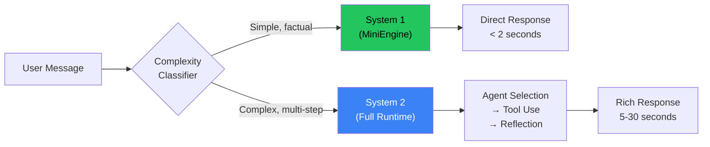

# AetherRavyn — Agent Architecture

> **"I am not a chatbot. I am not a tool. I am your cognitive extension — always watching, always learning, always three steps ahead."**
> — AetherRavyn (Ravyn)

---

## Identity

| Attribute | Value |
|-----------|-------|
| **Full Name** | AetherRavyn |
| **Short Name** | Ravyn |
| **Creator** | Swadhin Biswas |
| **Codename** | Project RAVEN → AetherRavyn |
| **Inspiration** | JARVIS / F.R.I.D.A.Y. (Iron Man) |
| **Core Principle** | Autonomy with accountability — act first, explain after, learn always |
| **License** | MIT |

---

## Architecture Overview

```
┌─────────────────────────────────────────────────────────────────┐
│                       AetherRavyn Core                          │
│                                                                   │
│  ┌──────────────┐   ┌─────────────┐   ┌──────────────────┐     │
│  │  Soul Engine  │   │ Ambient Loop│   │  Gateway Daemon   │     │
│  │  SOUL.md +    │   │ (Always-On) │   │  (All Channels)   │     │
│  │  MEMORY.md +  │   │  6 workers  │   │  Telegram/Discord │     │
│  │  AGENTS.md    │   │  heartbeat  │   │  Slack/WhatsApp   │     │
│  └──────┬───────┘   └──────┬──────┘   │  Signal/Matrix    │     │
│         │                   │          │  Web/Voice/IRC    │     │
│         ▼                   ▼          └────────┬─────────┘     │
│  ┌──────────────────────────────────────────────┴────────┐      │
│  │              Message Orchestrator                      │      │
│  │  System 1 (Fast) ←→ System 2 (Deep) ←→ Meta-Cognitive │      │
│  │  MiniEngine         Full Runtime       Strategy Select  │      │
│  └──────────────────────────┬───────────────────────────┘      │
│                              │                                    │
│  ┌───────────────────────────┴───────────────────────────┐      │
│  │              Agent Swarm Manager                       │      │
│  │                                                         │      │
│  │  ┌─────────┐ ┌──────────┐ ┌────────────┐ ┌─────────┐ │      │
│  │  │Assistant│ │Developer │ │ Researcher │ │Security │ │      │
│  │  │Agent    │ │Agent     │ │ Agent      │ │Agent    │ │      │
│  │  └─────────┘ └──────────┘ └────────────┘ └─────────┘ │      │
│  │  ┌─────────┐ ┌──────────┐ ┌────────────┐ ┌─────────┐ │      │
│  │  │Finance  │ │SysAdmin  │ │ News       │ │HomeGuard│ │      │
│  │  │Agent    │ │Agent     │ │ Agent      │ │Agent    │ │      │
│  │  └─────────┘ └──────────┘ └────────────┘ └─────────┘ │      │
│  │  ┌─────────┐ ┌──────────┐ ┌────────────┐ ┌─────────┐ │      │
│  │  │Reviewer │ │DataEng   │ │ Comms      │ │Scientist│ │      │
│  │  │Agent    │ │Agent     │ │ Agent      │ │Agent    │ │      │
│  │  └─────────┘ └──────────┘ └────────────┘ └─────────┘ │      │
│  │  ┌─────────┐ ┌──────────┐                             │      │
│  │  │Moral    │ │Productiv │     + Negotiation Protocol   │      │
│  │  │Agent    │ │Agent     │     + Blackboard Arch        │      │
│  │  └─────────┘ └──────────┘     + Cross-Training         │      │
│  └───────────────────────────────────────────────────────┘      │
│                              │                                    │
│  ┌───────────────────────────┴───────────────────────────┐      │
│  │              Tool Execution Layer                      │      │
│  │  55+ Tools │ MCP Server/Client │ Sandbox │ Resilience  │      │
│  └───────────────────────────┬───────────────────────────┘      │
│                              │                                    │
│  ┌───────────────────────────┴───────────────────────────┐      │
│  │              Memory & Knowledge Layer                  │      │
│  │  ChromaDB │ Neo4j │ PostgreSQL │ JSONL │ SkillRegistry │      │
│  └───────────────────────────────────────────────────────┘      │
└─────────────────────────────────────────────────────────────────┘
```

---

## Core Components

### 1. Soul Engine (`app/core/soul_engine.py`)

The Soul Engine is AetherRavyn's identity core. It loads and merges:

| File | Purpose | Auto-Updated |
|------|---------|:---:|
| **SOUL.md** | Personality definition (name, traits, principles, humor style) | By user |
| **MEMORY.md** | Persistent facts about the user (preferences, history, context) | ✅ By agent |
| **AGENTS.md** | Workspace-level instructions (project rules, coding standards) | By user |

The Soul Engine dynamically adjusts the system prompt based on:
- Time of day (energy level shifts)
- User mood (detected from conversation tone)
- Platform (more formal on Slack, casual on Telegram)
- Task type (technical precision for code, warmth for personal)

### 2. Dual Cognitive Architecture



**System 1 (MiniEngine)** — Fast, reflexive responses for:
- Greetings, small talk
- Simple factual lookups from memory
- Quick calculations
- Context-obvious follow-ups

**System 2 (Full Runtime)** — Deep, deliberate reasoning for:
- Multi-tool orchestration
- Agent delegation
- Code generation/review
- Research synthesis
- Any task requiring 3+ reasoning steps

**Meta-Cognitive Monitor** — Selects and monitors reasoning strategy:
- Tracks time spent, tool calls, confidence
- Adapts strategy mid-execution if first approach fails
- Calibrates confidence ("I'm 80% sure about this")

### 3. Agent Swarm Manager (`app/core/agency.py`)

14 specialist agents, each with:
- Unique system prompt optimized for their domain
- Preferred tool set
- Performance history (success rate per task type)
- Cross-training from other agents' successes

| Agent | Domain | Key Tools | Specialization |
|-------|--------|-----------|---------------|
| **AssistantAgent** | General assistance | All tools | Default catch-all |
| **DeveloperAgent** | Software development | ExecTool, FileTool, GitTool, DockerTool | Code, deploy, debug |
| **ResearcherAgent** | Deep research | WebSearch, WebFetch, URLTool | Synthesis, analysis |
| **SecurityAgent** | Cybersecurity | VirusTool, NetworkTool, BrowserTool | Audit, incident response |
| **FinanceAgent** | Finance & markets | FinanceTools, CryptoPriceTool | Portfolio, tax, budget |
| **SysadminAgent** | System administration | SystemStatsTool, DockerTool, ExecTool | Server ops, monitoring |
| **NewsAgent** | Current events | NewsTools, RSSReaderTool, TwitterTool | Briefings, trends |
| **HomeGuardianAgent** | Smart home & security | SmartHomeTool, SensorReadTool, CameraSnapshotTool | IoT, surveillance |
| **ReviewerAgent** | Code & content review | FileTool, GitTool | Quality gates |
| **DataEngineerAgent** | Data processing | ExecTool, FileTool | ETL, analytics |
| **CommunicationsAgent** | Messaging & email | MailTool, MessagingTool | Drafting, scheduling |
| **ScientistAgent** | Scientific analysis | WolframTool, WebSearch | Research, computation |
| **ProductivityAgent** | Task management | TodoListTool, PomodoroTool, ReminderTool | Planning, habits |
| **MoralAgent** | Ethics & safety | (reasoning only) | Guardrails, policy |
| **NegotiatorAgent** | Conflict resolution | (reasoning only) | Agent disagreements |
| **LearnerAgent** | Skill tracking | SkillRegistry, MemoryTool | Cross-training |

### 4. Tool Execution Layer

**60+ tools** organized into domains:

| Domain | Tools | Count |
|--------|-------|:-----:|
| **Web & Search** | WebSearch, WebFetch, URLTool, BrowserTool, SearXNGTool | 5 |
| **File & Code** | FileTool, WriteTool, ExecTool, GitTool, PatchTool | 5 |
| **Communication** | MailTool, MessagingTool, DeliverFileTool | 3 |
| **DevOps** | DockerTool, DockerExecTool, SandboxTool | 3 |
| **Finance** | FinanceTools, CryptoPriceTool, YFinance | 3 |
| **Media** | ImageGenTool, XAIImageTool, YouTubeTool, MusicTools | 4 |
| **Smart Home** | SmartHomeTool, SensorReadTool, CameraSnapshotTool | 3 |
| **Productivity** | TodoListTool, PomodoroTool, ReminderTool, WorkflowTool | 4 |
| **Network & Security** | NetworkTool, VirusTool, TOTPGenTool, InternetIntelTool | 4 |
| **Device Automation** | BrowserOps (22), MobileDevice (24), DesktopControl (16), ScreenReader (8), ComputerUse (5) | 75 ops |
| **Knowledge** | MemoryTool, KGTool, ObsidianTool | 3 |
| **Weather & Geo** | WeatherTool, AirQualityTool, CommuteTool | 3 |
| **Data** | WolframTool, RedditTool, TwitterTool, RSSReaderTool | 4 |
| **System** | SystemStatsTool, EdgesTool, GovernanceTool | 3 |
| **Scheduling** | DBSchedulerTool, CronEngine | 2 |
| **Autonomy** | AutonomyTool, AgencyTool, ElevatedTool | 3 |

### 5. Memory & Knowledge Layer

```
┌──────────────────────────────────────────────┐
│              Memory Architecture              │
│                                                │
│  ┌─────────┐  ┌──────────┐  ┌──────────────┐ │
│  │ ChromaDB│  │PostgreSQL│  │    Neo4j     │ │
│  │ Semantic │  │Relational│  │Knowledge     │ │
│  │ Memory   │  │Sessions  │  │Graph         │ │
│  │ (Vector) │  │Events    │  │(Entities +   │ │
│  │          │  │Goals     │  │ Relations)   │ │
│  └────┬─────┘  └────┬─────┘  └──────┬───────┘ │
│       │              │               │          │
│       ▼              ▼               ▼          │
│  ┌────────────────────────────────────────────┐ │
│  │         Unified Memory Manager             │ │
│  │  • Store/retrieve memories                 │ │
│  │  • Cross-reference across stores           │ │
│  │  • Attention-weighted retrieval             │ │
│  │  • Memory consolidation (nightly)           │ │
│  └────────────────────────────────────────────┘ │
│                                                  │
│  ┌─────────┐  ┌──────────┐  ┌──────────────┐   │
│  │ SOUL.md │  │MEMORY.md │  │  AGENTS.md   │   │
│  │ Identity│  │User Facts│  │  Workspace   │   │
│  └─────────┘  └──────────┘  └──────────────┘   │
└──────────────────────────────────────────────────┘
```

**Memory Types:**
- **Episodic** — What happened in conversations (ChromaDB vectors)
- **Semantic** — Facts about the user and world (MEMORY.md + ChromaDB)
- **Procedural** — How to do things (Skills system)
- **Spatial** — Where things are (future: vision system)
- **Working** — Current focus (7±2 item attention buffer)

### 6. Ambient Intelligence Loop (`app/core/ambient_loop.py`)

The always-on background heartbeat that makes Ravyn proactive:

```
┌────────────────────────────────────────────┐
│           Ambient Loop (60s cycle)          │
│                                              │
│  ┌──────────────┐  ┌────────────────────┐  │
│  │ Self-Improve  │  │ Calendar Watcher   │  │
│  │ Analyze perf  │  │ Upcoming events    │  │
│  │ Update skills │  │ Prep suggestions   │  │
│  └──────────────┘  └────────────────────┘  │
│                                              │
│  ┌──────────────┐  ┌────────────────────┐  │
│  │ Workflow Tick │  │ Sentinel Bridge    │  │
│  │ Active tasks  │  │ Security events    │  │
│  │ Progress push │  │ Camera alerts      │  │
│  └──────────────┘  └────────────────────┘  │
│                                              │
│  ┌──────────────┐  ┌────────────────────┐  │
│  │ Health Check  │  │ Memory Consolidate │  │
│  │ Service status│  │ Nightly compress   │  │
│  │ Degradation   │  │ Fact extraction    │  │
│  └──────────────┘  └────────────────────┘  │
└────────────────────────────────────────────┘
```

### 7. Output Priority Router (`app/core/output_router.py`)

Not all messages are equal. The router decides how to deliver:

| Priority | Channel | Example |
|----------|---------|---------|
| **CRITICAL** | Voice + Primary Chat | "Intruder detected on camera 3" |
| **HIGH** | Primary Chat | "Your deployment failed" |
| **NORMAL** | Current Channel | Regular responses |
| **LOW** | Task Inbox | "Weekly report ready" |
| **SILENT** | Log Only | Background skill improvements |

---

## Channel Architecture

```
┌─────────────────────────────────────────────────┐
│              Gateway Daemon                       │
│              ravyn gateway start                  │
│                                                   │
│  ┌─────────────────────────────────────────────┐ │
│  │           Channel Registry                   │ │
│  │                                               │ │
│  │  Telegram  Discord  Slack  WhatsApp  Web     │ │
│  │  Signal    Matrix   IRC   Voice     MQTT     │ │
│  │                                               │ │
│  │  Each channel → Session → Agent Assignment    │ │
│  └─────────────────────────────────────────────┘ │
│                                                   │
│  ┌─────────────────────────────────────────────┐ │
│  │           Session Manager                    │ │
│  │                                               │ │
│  │  Main Session (your primary identity)        │ │
│  │  DM Sessions (per-user, sandboxed)           │ │
│  │  Channel Sessions (per-channel context)      │ │
│  └─────────────────────────────────────────────┘ │
│                                                   │
│  ┌─────────────────────────────────────────────┐ │
│  │           DM Pairing                         │ │
│  │                                               │ │
│  │  Unknown sender → Pairing code → Admin OK    │ │
│  │  Allowlist → Direct access                   │ │
│  └─────────────────────────────────────────────┘ │
└─────────────────────────────────────────────────┘
```

---

## CLI Reference

```bash
# Core
ravyn chat                     # Interactive terminal chat
ravyn daemon                   # Start full system (API + background loops)
ravyn status                   # Show system status and pending tasks

# Gateway Daemon
ravyn gateway start            # Start persistent daemon
ravyn gateway stop             # Stop daemon
ravyn gateway status           # Check if running
ravyn gateway restart          # Restart daemon
ravyn gateway install-daemon   # Install systemd service

# Setup
ravyn onboard                  # Interactive setup wizard
ravyn doctor                   # Diagnose all issues

# Model
ravyn model list               # List available providers/models
ravyn model test               # Test current model
ravyn model set --provider X --model Y  # Override model (runtime)

# Skills
ravyn skills                   # List all installed skills

# MCP Server
ravyn mcp-serve                # Start as MCP tool server

# Task Management
ravyn approve TASK_ID          # Approve a pending task

# Edge Node
ravyn edge-node --name X       # Run as an edge device

# Conversation Commands (in chat)
/new                           # New conversation
/reset                         # Reset context
/compress                      # Compress trajectory
/model [provider:model]        # Switch model
/skills                        # List active skills
/status                        # Agent status
```

---

## Security Model

### Principles
1. **Least Privilege** — Tools get minimum required permissions
2. **Sandbox by Default** — Non-main sessions run in containers
3. **Explicit Trust** — DM access requires pairing approval
4. **Audit Trail** — Every tool execution is logged
5. **Secret Vault** — API keys encrypted at rest, never in logs

### Threat Model

| Threat | Mitigation |
|--------|-----------|
| Prompt injection via DM | DM pairing + message sanitization |
| Tool abuse by compromised agent | Per-session tool allowlists |
| Secret exfiltration | Encrypted vault + audit log |
| Sandbox escape | Docker container isolation |
| Denial of service | Rate limiting + circuit breaker |

---

## Deployment Modes

### 1. Interactive Chat
```bash
ravyn chat                     # Terminal chat interface
```

### 2. Full Daemon (all channels + web dashboard)
```bash
ravyn daemon                   # Start everything in foreground
# OR
python main.py                 # Direct start
```

### 3. Persistent Daemon (systemd)
```bash
ravyn gateway install-daemon   # Generate systemd service file
systemctl --user daemon-reload
systemctl --user enable aetherravyn
systemctl --user start aetherravyn
ravyn gateway status           # Check if running
```

### 4. Docker
```bash
docker compose up -d           # Full stack
```

### 5. MCP Server Mode
```bash
ravyn mcp-serve                # Start as MCP tool server (stdio)
```

---

## Comparison: AetherRavyn vs Competitors

| Capability | Hermes Agent | OpenClaw | AetherRavyn |
|------------|:---:|:---:|:---:|
| **Stars** | 177k | 377k | — |
| **Language** | Python | TypeScript | Python |
| **Specialist Agents** | 1 (monolithic) | 1 (monolithic) | **14 specialists** |
| **Dual Cognition** | ❌ | ❌ | **✅ System 1/2** |
| **Tools** | ~30 | ~30 | **60+ tools** |
| **Self-Evolving Skills** | ✅ | ✅ | **✅ Auto-learn from experience** |
| **Voice Pipeline** | ❌ (TTS only) | ✅ (macOS/iOS) | **✅ STT + TTS (Telegram/Discord)** |
| **Device Automation** | ❌ | ❌ | **✅ Browser (Mobile/Desktop scaffolded)** |
| **Sensor Fusion** | ❌ | ❌ | **✅ MQTT + Camera + Calendar** |
| **Ambient Loop** | ❌ | ❌ | **✅ 11-worker heartbeat** |
| **Autonomy Engine** | ❌ | ❌ | **✅ State machine + retry + journal** |
| **Agent Negotiation** | ❌ | ❌ | **✅ Structured debate protocol** |
| **Meta-Cognition** | ❌ | ❌ | **✅ Strategy selection + confidence** |
| **Cross-Training** | ❌ | ❌ | **✅ LearnerAgent tracks performance** |
| **Opportunity Detection** | ❌ | ❌ | **✅ Proactive suggestions** |
| **Knowledge Graph** | ❌ | ❌ | **✅ Neo4j auto-population** |
| **Web Dashboard** | ❌ | ✅ | **✅ 40+ API endpoints + WebSocket** |
| **Live Canvas** | ❌ | ✅ | **✅ Agent-driven visual workspace** |
| **Gateway Daemon** | ❌ | ✅ | **✅ PID + hot-restart + systemd** |
| **CLI** | ❌ | ✅ | **✅ 12 commands** |
| **Channels** | 6 | 25+ | **7 working + voice** |
| **Companion Apps** | ❌ | ✅ | **✅ Web Dashboard + Live Canvas** |
| **Live Canvas** | ❌ | ✅ | **✅ Agent-driven visual workspace** |
| **MCP Support** | ✅ | ✅ | **✅ Server + Client** |
| **Sandboxing** | ❌ | ✅ Docker | **✅ Docker + Subprocess** |

### Implementation Status Legend

| Status | Meaning |
|--------|---------|
| ✅ Working | Fully implemented and integrated |
| ✅ Scaffolded | Code exists, needs integration/testing |
| ❌ Planned | Not yet implemented |

### Current Implementation Status (as of June 2026)

**Working:**
- 14 specialist agents (Finance, Researcher, Security, Reviewer, Sysadmin, Developer, Assistant, News, HomeGuardian, Communications, Scientist, Productivity, DataEngineer, Moral)
- Dual-system cognition (MiniEngine + AgentRuntime)
- 60+ tools across 10+ domains
- ChromaDB semantic memory
- 7 channels: Telegram, Discord, Slack, WhatsApp, Signal, Matrix, IRC
- Voice channel (wake word → STT → LLM → TTS)
- Voice transcription (STT) and synthesis (TTS) for Telegram/Discord
- Ambient loop with 11 workers
- Autonomy engine with goal tracking
- Agent negotiation protocol
- Skill learner (auto-creates skills from interactions)
- Soul Engine (SOUL.md + MEMORY.md + AGENTS.md)
- Meta-cognitive monitoring (strategy selection + performance tracking)
- Cross-training (LearnerAgent tracks agent performance per category)
- Knowledge graph auto-population (extracts entities from conversations)
- Proactive opportunity detection (deadlines, follow-ups, patterns)
- Memory consolidation (extracts facts/preferences from sessions)
- **Web Dashboard** (40+ API endpoints, WebSocket chat, event streaming)
- **Live Canvas** (agent-driven visual workspace with charts, tables, metrics)
- **Gateway Daemon** (PID file, channel tracking, hot-restart, systemd support)
- **CLI** (chat, daemon, status, gateway start/stop/restart, model list/test/set, skills, doctor, onboard)

**Scaffolded (needs integration):**
- Mobile/Desktop/Screen device control
- Discord voice channel joining

**Planned:**
- Native companion apps (macOS menu bar, iOS node, Android node)
- Skill marketplace
- Browser/Mobile/Desktop full automation

---

## The AetherRavyn Difference

> **Hermes** is an agent that *answers* you.
> **OpenClaw** is an assistant that *reaches* you on every channel.
> **AetherRavyn** is a *cognitive extension* that *thinks with you, learns for you, and acts ahead of you*.

The competitors are message-in, message-out pipes with good skill systems. AetherRavyn is a **multi-agent cognitive architecture** with:

1. **14 specialist agents** that negotiate, debate, and cross-train
2. **Dual-system cognition** that knows when to think fast and when to think deep
3. **60+ tools** across web, file, finance, smart home, and more
4. **Sensor fusion** that gives it environmental awareness via MQTT and calendar
5. **An ambient loop** that makes it proactive, not just reactive
6. **Self-evolving skills** that make it smarter with every interaction
7. **7 channels + voice** for ubiquitous presence
8. **Meta-cognition** that tracks its own performance and adapts strategies
9. **Cross-training** where agents learn from each other's successes
10. **Opportunity detection** that identifies deadlines, follow-ups, and patterns
11. **Live Canvas** — agent-driven visual workspace with charts, metrics, and tables
12. **Gateway Daemon** with hot-restart, systemd integration, and channel management

This isn't an incremental improvement. It's a categorical difference.

**A calculator vs. a colleague. A chatbot vs. a JARVIS.**

---

*Built by Swadhin Biswas. Powered by rage, ambition, and the refusal to settle for "good enough."*
