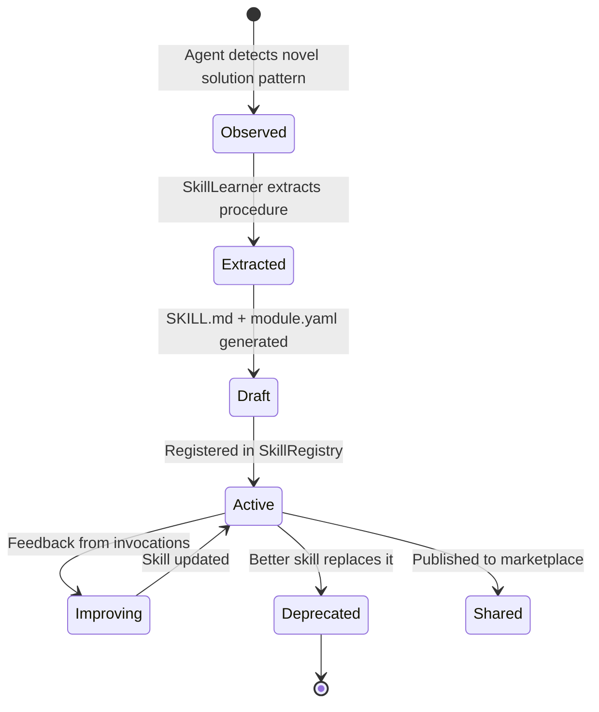

# AetherRavyn — Skills System Architecture

> **The skill system is Ravyn's evolution engine. Every interaction is a chance to learn. Every learned pattern becomes a reusable skill. The agent that writes its own playbook wins.**

---

## Philosophy

JARVIS doesn't ask Tony Stark how to deploy a suit update twice. He learns, internalizes, and executes faster next time. AetherRavyn's skill system follows the same principle:

1. **Skills are executable knowledge** — not just documentation, but actionable procedures
2. **Skills evolve** — every invocation improves the skill through feedback
3. **Skills compose** — complex behaviors emerge from combining simple skills
4. **Skills are portable** — share between workspaces, export to community
5. **Skills have memory** — they remember what worked and what didn't

---

## Skill Anatomy

Every skill lives in a directory under `skills/` with this structure:

```
skills/
├── bundled/                    # Ship with AetherRavyn
│   ├── code_reviewer/
│   │   ├── SKILL.md            # Skill manifest + instructions
│   │   ├── module.yaml         # Canonical registry manifest
│   │   └── templates/          # Reusable templates
│   ├── morning_briefing/
│   ├── security_audit/
│   └── deploy_pipeline/
├── learned/                    # Auto-created by Ravyn from experience
│   ├── fix_docker_timeout/
│   │   ├── SKILL.md
│   │   ├── module.yaml
│   │   └── history.jsonl       # Invocation history + outcomes
│   └── optimize_sql_query/
├── workspace/                  # Project-specific skills
│   └── aurora_paper_review/
└── community/                  # Downloaded from skill marketplace
    └── kubernetes_debugger/
```

---

## SKILL.md Format

```yaml
---
name: Docker Timeout Fix
module_id: skill.fix_docker_timeout
version: 1.2.0
category: skill
description: Diagnose and fix Docker build timeouts using multi-stage builds and layer caching
tags: [docker, devops, deployment, timeout]
capabilities: [docker-diagnosis, build-optimization, layer-caching]
trust_level: workspace
enabled_by_default: true
stability: stable
maturity: production

# Learning metadata
origin: learned                # bundled | learned | workspace | community
learned_from: "2026-03-15T14:30:00Z conversation about Docker deployment failure"
invocation_count: 23
success_rate: 0.91
last_improved: "2026-05-28T09:15:00Z"

# Trigger conditions — when should Ravyn auto-invoke this skill?
triggers:
  - pattern: "docker.*build.*timeout"
    confidence: 0.85
  - pattern: "container.*slow.*build"
    confidence: 0.70
  - context: "deployment failure with timeout"

# Dependencies
dependencies:
  - name: docker
    status: required
    check: "command -v docker"
  - name: dockerfile_present
    status: recommended
    check: "test -f Dockerfile"
---

# Docker Timeout Fix

## When to Use
This skill activates when a Docker build exceeds the expected timeout. Common causes:
- Large base images without multi-stage builds
- No layer caching (downloading dependencies every build)
- Unnecessary files in build context (missing .dockerignore)

## Procedure

### Step 1: Diagnose
1. Check if `.dockerignore` exists
2. Analyze Dockerfile for multi-stage build patterns
3. Measure current image size
4. Check dependency caching strategy

### Step 2: Fix
1. Add `.dockerignore` if missing (exclude node_modules, .git, __pycache__, etc.)
2. Convert to multi-stage build if single-stage
3. Separate dependency install from code copy (cache layers)
4. Use slim/alpine base images where possible

### Step 3: Verify
1. Rebuild and time the process
2. Compare image size before/after
3. Confirm application starts correctly

## Example

**Before:**
```dockerfile
FROM python:3.12
COPY . /app
RUN pip install -r requirements.txt
CMD ["python", "main.py"]
```

**After:**
```dockerfile
FROM python:3.12-slim AS builder
WORKDIR /app
COPY requirements.txt .
RUN pip install --no-cache-dir -r requirements.txt
COPY . .

FROM python:3.12-slim
WORKDIR /app
COPY --from=builder /app .
CMD ["python", "main.py"]
```

## Lessons Learned
- Always check .dockerignore first — it's the #1 cause of slow builds
- Alpine images save ~400MB but can break packages that need glibc
- Multi-stage builds reduce final image by 60-80% on average
```

---

## Skill Lifecycle



### 1. **Observation** — Ravyn notices it solved something complex
The `SkillLearner` monitors the orchestrator's execution trace. When it detects:
- A multi-step solution involving 3+ tool calls
- User expressed satisfaction (thumbs up, "perfect", "thanks")
- The same class of problem has been solved before

It triggers skill extraction.

### 2. **Extraction** — Pattern → Procedure
The LLM is prompted to:
- Name the skill
- Describe the trigger conditions
- Write a step-by-step procedure
- Extract reusable parameters
- Identify dependencies

### 3. **Registration** — Skill enters the registry
- `module.yaml` is auto-generated
- Health checks run (dependencies, format)
- Skill is indexed in ChromaDB for semantic search

### 4. **Invocation** — Skill is used
When a matching trigger fires:
- Skill instructions are injected into the system prompt
- Agent follows the procedure
- Outcome is logged to `history.jsonl`

### 5. **Improvement** — Skill evolves
After each invocation:
- Success/failure is recorded
- If failure rate > 20%, skill is flagged for review
- Successful variations are merged back
- Version is bumped

---

## Skill Categories

| Category | Description | Examples |
|----------|-------------|----------|
| **DevOps** | Deployment, CI/CD, Docker, K8s | `deploy_pipeline`, `fix_docker_timeout`, `k8s_debug` |
| **Code** | Code review, refactoring, testing | `code_reviewer`, `test_generator`, `refactor_advisor` |
| **Research** | Web research, paper analysis, synthesis | `paper_reviewer`, `competitive_analysis`, `literature_review` |
| **Communication** | Email drafting, meeting prep, reports | `email_drafter`, `meeting_prep`, `status_report` |
| **Finance** | Portfolio analysis, tax prep, budgeting | `portfolio_review`, `expense_tracker`, `tax_helper` |
| **Security** | Vulnerability scanning, incident response | `security_audit`, `incident_response`, `cve_checker` |
| **Productivity** | Time management, task planning, habits | `morning_briefing`, `pomodoro`, `weekly_review` |
| **Home** | Smart home, IoT, surveillance | `morning_routine`, `security_check`, `energy_optimizer` |
| **Creative** | Writing, design, brainstorming | `blog_writer`, `pitch_deck`, `brainstorm_facilitator` |
| **System** | System admin, monitoring, debugging | `server_health`, `log_analyzer`, `performance_tuner` |

---

## Bundled Skills (Ship with AetherRavyn)

### 1. Code Reviewer
Analyzes code changes, identifies bugs, suggests improvements, checks style.
- **Trigger**: `review this code`, `check my PR`, code file attached
- **Tools Used**: FileTool, GitTool, ExecTool
- **Agent**: DeveloperAgent + ReviewerAgent

### 2. Morning Briefing
Comprehensive morning report: weather, calendar, tasks, news, portfolio.
- **Trigger**: Scheduled cron at user-configured time
- **Tools Used**: WeatherTool, CalendarWatcher, NewsTool, FinanceTool
- **Agent**: AssistantAgent

### 3. Security Audit
Scans codebase for vulnerabilities, checks dependencies, reviews permissions.
- **Trigger**: `security audit`, `check vulnerabilities`, new PR
- **Tools Used**: VirusTool, ExecTool, GitTool, BrowserTool
- **Agent**: SecurityAgent

### 4. Deploy Pipeline
Full deployment workflow: build, test, deploy, monitor, rollback.
- **Trigger**: `deploy to production`, `ship it`, `release`
- **Tools Used**: DockerTool, GitTool, ExecTool, MessagingTool
- **Agent**: DeveloperAgent + SysadminAgent

### 5. Research Synthesis
Deep research on a topic: search, read, analyze, synthesize report.
- **Trigger**: `research X`, `give me a report on`, `deep dive into`
- **Tools Used**: WebSearch, WebFetch, URLTool, FileTool
- **Agent**: ResearcherAgent

### 6. Incident Response
Real-time incident handling: diagnose, contain, fix, post-mortem.
- **Trigger**: Alert from monitoring, `incident`, `system down`
- **Tools Used**: SystemStatsTool, DockerTool, NetworkTool, MessagingTool
- **Agent**: SecurityAgent + SysadminAgent

### 7. Meeting Prep
Prepare for upcoming meetings: agenda, context, participant profiles, talking points.
- **Trigger**: Calendar event approaching, `prepare for meeting`
- **Tools Used**: CalendarWatcher, MailTool, WebSearch, FileTool
- **Agent**: ProductivityAgent

### 8. Weekly Review
End-of-week retrospective: goals progress, tasks completed, insights, next week plan.
- **Trigger**: Scheduled Friday afternoon cron
- **Tools Used**: TodoListTool, MemoryTool, GoalManager
- **Agent**: ProductivityAgent + AssistantAgent

---

## Skill API

### SkillLearner — Auto-creates skills from experience
```python
class SkillLearner:
    async def observe(self, execution_trace: ExecutionTrace) -> None:
        """Monitor orchestrator execution for skill-worthy patterns."""

    async def extract(self, trace: ExecutionTrace) -> SkillDraft:
        """Use LLM to extract a reusable skill from the trace."""

    async def save(self, draft: SkillDraft) -> SkillRecord:
        """Save skill to skills/learned/ with SKILL.md + module.yaml."""

    async def improve(self, skill_id: str, feedback: Feedback) -> None:
        """Improve an existing skill based on invocation feedback."""
```

### SkillRegistry — Discovers and manages skills
```python
class SkillRegistry:
    def discover(self) -> list[SkillRecord]:
        """Scan all skill roots for manifests."""

    def get_active_skill_texts(self) -> str:
        """Get concatenated instructions from all enabled skills."""

    def match_skills(self, query: str) -> list[SkillRecord]:
        """Semantic search for skills matching a user query."""

    def load_plugin_tools(self) -> list[Tool]:
        """Load Python tools from plugin entrypoints."""
```

### SkillInvoker — Executes skills
```python
class SkillInvoker:
    async def invoke(self, skill: SkillRecord, context: dict) -> SkillResult:
        """Execute a skill's procedure, logging the outcome."""

    async def auto_invoke(self, user_message: str) -> SkillResult | None:
        """Check triggers and auto-invoke matching skills."""
```

---

## Skill Marketplace (Future — Phase 6)

```
ravyn skills list              # List all installed skills
ravyn skills search "docker"   # Search community marketplace
ravyn skills install k8s-debug # Install from marketplace
ravyn skills publish my-skill  # Publish to marketplace
ravyn skills update            # Update all community skills
ravyn skills create "name"     # Scaffold a new skill
```

### Marketplace URL: `https://skills.aetherravyn.dev` (future)

---

## Configuration

```env
# Skills system
SKILL_LEARNING_ENABLED=true        # Auto-learn skills from interactions
SKILL_AUTO_INVOKE_ENABLED=true     # Auto-invoke matching skills
SKILL_CONFIDENCE_THRESHOLD=0.75    # Min confidence for auto-invocation
SKILL_MAX_LEARNED=100              # Max auto-learned skills
SKILL_REVIEW_AFTER_FAILURES=3      # Flag for review after N failures
```

---

## Integration Points

| Component | How Skills Interact |
|-----------|-------------------|
| **Orchestrator** | Injects active skill texts into system prompt |
| **SkillLearner** | Monitors execution traces, creates new skills |
| **SkillRegistry** | Discovers, indexes, health-checks skills |
| **Ambient Loop** | Periodic skill review and improvement |
| **CLI** | `/skills` command for listing, searching, creating |
| **MCP Server** | Exposes skills as MCP tools |
| **ChromaDB** | Semantic indexing for skill search and matching |
| **APScheduler** | Cron-triggered skill invocations |

---

*Skills are the DNA of AetherRavyn. They encode what the agent has learned, how it should act, and how it can grow. Every skill is a battle scar turned into armor.*
