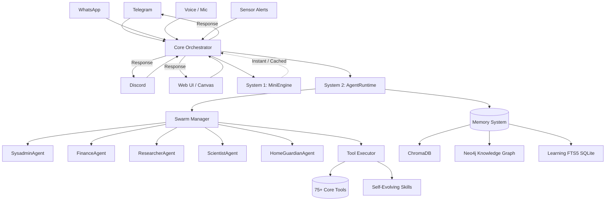

# 01 - System Architecture

## Design Principle: One Brain, Many Mouths

RAVEN employs a unified **hub-and-spoke** model. It has a single intelligent core (the "brain") that receives messages from multiple platforms and responds through the platform the user spoke from. 



---

## Full Architecture Layers

### Layer 1: Platform Connectors (Async, Always-on)
Platform connectors listen continuously. Messages are ingested asynchronously into the unified message bus. 
Supported platforms include Telegram, Discord, WhatsApp, Slack, Signal, Matrix, IRC, Voice I/O, and the Web UI Dashboard.

### Layer 2: Core Orchestrator (The Entrypoint)
The `Orchestrator` (`app/core/orchestrator.py`) handles all incoming requests:
1. **Identity Resolution**: Maps platform-specific user IDs to a canonical RAVEN user ID.
2. **Security & Moderation**: Front-door prompt injection checks (`SecurityGuard`) and per-user sliding window Rate Limiting.
3. **DM Pairing Enforcement**: Validates user access based on configured channels.
4. **Metrics**: Logs request stats to Prometheus.
5. **System Routing**: Routes the payload to either System 1 or System 2.

### Layer 3: Dual-System Cognition
RAVEN implements a Kahneman-inspired dual-system cognitive architecture:
* **System 1 (MiniEngine / Fast Router)**: Used for instantaneous, cached, or highly trivial requests (e.g., greetings, asking for the time). It bypasses complex agent reasoning for maximum speed.
* **System 2 (AgentRuntime)**: Used for complex, multi-step reasoning. It spins up a ReAct loop with a maximum of 10 turns and grants full access to the Tool Ecosystem and Swarm Agency.

### Layer 4: Multi-Agent Swarm (Agency)
When System 2 encounters a complex request requiring domain expertise, it delegates to the `SwarmManager` (`app/core/agency.py`). The Swarm consists of 14 specialized agents (e.g., `SysadminAgent`, `PolymathAgent`, `FinanceAgent`, `ResearcherAgent`). 

A unique **LearnerAgent** acts as a cross-trainer, monitoring performance and providing meta-cognitive advice to other agents.

### Layer 5: Self-Evolving Skills System
RAVEN is capable of learning from user interactions:
* **SkillRegistry**: Discovers, parses, and loads static tool skills.
* **SkillLearner**: Deeply integrated into the orchestrator. It observes execution traces of System 2. If an agent performs a successful, multi-step tool sequence that satisfies the user, the `SkillLearner` synthesizes this into a reusable SKILL and saves it to `skills/learned/`.

### Layer 6: Memory & State Stores
RAVEN maintains long-term persistence across multiple database technologies:
1. **ChromaDB**: Semantic memory and vector embeddings for conversational recall and semantic rule fetching.
2. **Neo4j**: Auto-populated Knowledge Graph providing structured relationship tracking.
3. **SQLite + FTS5**: Unified learning database for storing execution signals and cross-training data.

### Layer 7: Tool Ecosystem & Execution
The Tool Executor provides the agents with 75+ core tools and 15 device automation operations (e.g., File, Git, Web Fetching, Finance, Smart Home control, Document parsing).

---

## Process Lifecycle

The RAVEN bot server runs as a **single Python process** using async coroutines. This is simpler and more reliable than microservices for local/personal setups.

```python
# main.py -- conceptual entry point
import asyncio
from app.core.orchestrator import Orchestrator

async def main():
    # Initialize the core components (LLM, Memory, Tools, Swarm)
    orchestrator = Orchestrator()
    await orchestrator.initialize()

    # Start all platform connectors concurrently
    await asyncio.gather(
        start_telegram_connector(orchestrator),
        start_discord_connector(orchestrator),
        start_web_dashboard(orchestrator),
        start_ambient_loop(orchestrator),
    )

if __name__ == "__main__":
    asyncio.run(main())
```

### Why a Single Process?
For a JARVIS-class personal agent, zero network hops and shared memory (for the Swarm and Memory systems) result in massive latency reductions compared to distributed microservices.

---

## The Unified Message Format

Every incoming message is normalized before entering the Orchestrator:

```json
{
  "id": "msg-uuid",
  "platform": "telegram",
  "user_id": "user-uuid",
  "text": "Analyze the latest stock market trends.",
  "metadata": {
    "chat_id": "123456789",
    "reply_to": "..."
  },
  "timestamp": "2026-07-05T10:30:00Z"
}
```
Voice is translated to text (via STT) prior to hitting the brain. Images are described by a Vision Language Model (VLM) before text extraction is processed. Commands (`/`) are immediately intercepted and executed bypassing the full cognitive loop when appropriate.
